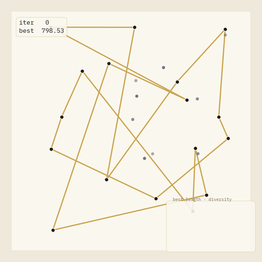
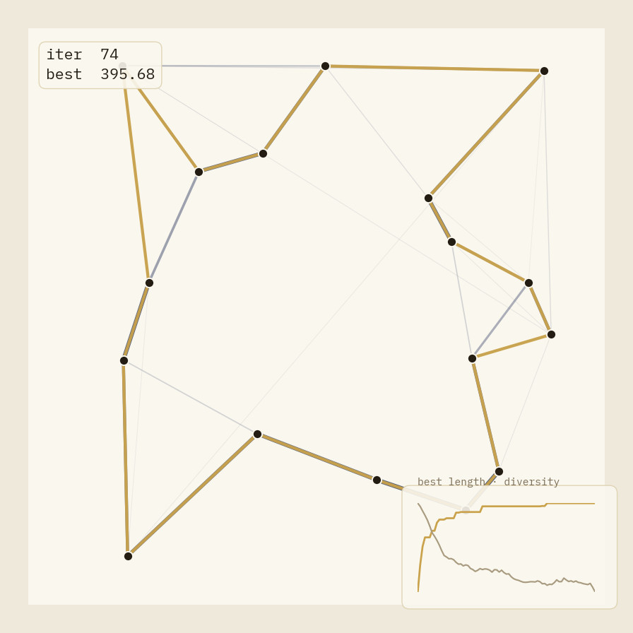
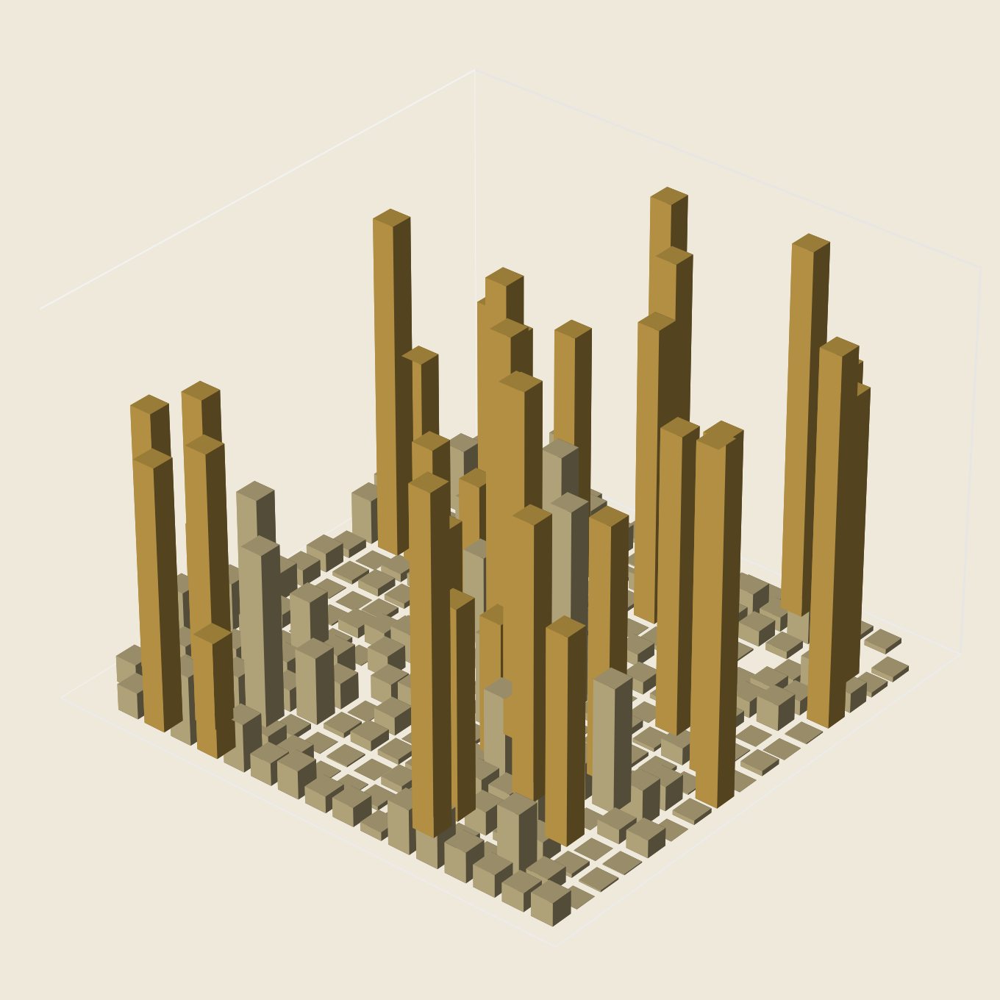
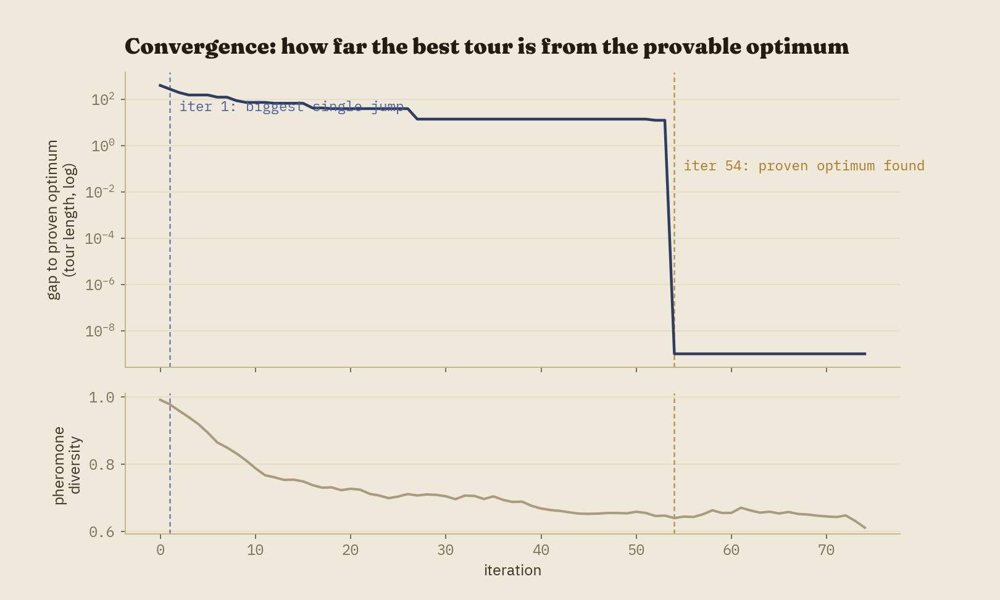
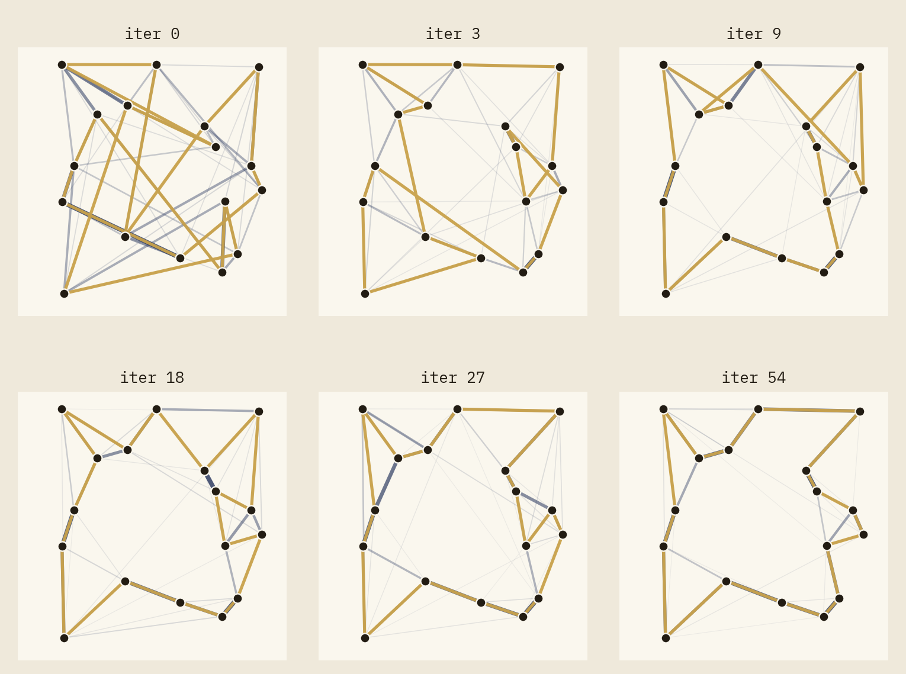

# Ant Colony Optimization

**Watch a colony learn a route.**

A from-scratch, publication-quality visualization of Elitist Ant System solving a small Traveling Salesman instance — built to be watched, not just run. Part 2 of an [Operations Research visualization series](#series); see [Genetic Algorithm Evolution](../genetic-algorithm-evolution) for part 1, which shares this project's visual language.



17 cities, 24 ants, and a pheromone map that starts uniform and ends up pointing almost entirely at the *provably* optimal tour — verified against an exact Held-Karp solver, not just "whatever the colony settled on." Nothing here is scripted: it's the actual, seeded, reproducible output of the algorithm in `src/`.

## Contents

- [What this is](#what-this-is)
- [Preview](#preview)
- [Installation](#installation)
- [Quick start](#quick-start)
- [Project architecture](#project-architecture)
- [The algorithm, briefly](#the-algorithm-briefly)
- [Visualization design](#visualization-design)
- [Customization](#customization)
- [Testing](#testing)
- [Reproducibility](#reproducibility)
- [Series](#series)
- [References](#references)
- [Future improvements](#future-improvements)
- [License](#license)

## What this is

This repository implements Elitist Ant System and renders every stage of the search as a coherent set of 2D and 3D visualizations: a flagship animation, an annotated convergence chart, a small-multiples filmstrip, and an animated 3D pheromone-matrix bar chart. The accompanying blog post explains the algorithm and the design choices behind each visualization in depth; this README is about running and extending the code.

## Preview

| | |
|---|---|
|  |  |
| Flagship 2D animation (final frame) | Pheromone matrix as a 3D bar chart — gold spikes are the optimal tour's edges |
|  |  |
| Convergence chart — gap to proven optimum (log) & diversity | Filmstrip: iterations 0, 3, 9, 18, 27, 54 |

The animated 3D pheromone video and full-resolution MP4s are in [`assets/generated/`](assets/generated/) after you run the render scripts — `aco_pheromone_3d.mp4` (~23s) is worth a look: a nearly-flat field of 272 candidate edges collapses into a sparse handful of dramatic spikes as the colony converges.

## Installation

```bash
git clone <this-repo>
cd ant-colony-optimization
pip install -e ".[dev]"
```

Requires Python 3.10+, and `ffmpeg` on your `PATH` for MP4 export.

Optional but recommended — install the exact display fonts used throughout every visualization:

```bash
bash scripts/install_fonts.sh
```

## Quick start

```bash
# Run ACO and print a summary (no rendering, <1 second)
python -c "
from src.aco.graph import random_city_layout
from src.aco.engine import ACOConfig, run_aco
from src.aco.exact_solver import solve_held_karp
import numpy as np
layout = random_city_layout(17, np.random.default_rng(0), min_separation=8.0)
exact = solve_held_karp(layout.distances)
history = run_aco(layout, ACOConfig())
print(f'optimum: {exact.length:.2f}, found: {history.final.best_ever_length:.2f}')
"

# Render the flagship 2D animation (MP4 + GIF variants + PNG snapshots), ~65s
python scripts/render_animation.py

# Render the 3D hero image, 3D animation, convergence chart, and filmstrip, ~90s
python scripts/render_supplementary.py
```

All outputs land in `assets/generated/`.

## Project architecture

```
ant-colony-optimization/
├── src/
│   ├── aco/
│   │   ├── graph.py            # city generation, distance matrix, tour length
│   │   ├── exact_solver.py     # Held-Karp DP — provable optimum for the convergence chart
│   │   ├── pheromone.py        # init, evaporation, deposit, elite bonus, entropy/diversity
│   │   ├── construction.py     # probabilistic tour construction (random-proportional rule)
│   │   └── engine.py           # orchestrates the loop, records per-iteration history
│   ├── viz/
│   │   ├── theme.py                  # shared color palette / typography / 3D axes setup
│   │   ├── fonts.py                  # registers Fraunces/IBM Plex with matplotlib
│   │   ├── graph_renderer.py         # cities + pheromone-weighted edges + best-tour overlay
│   │   ├── ant_artist.py             # arc-length-parameterized ant walking animation
│   │   ├── hud.py                    # in-animation iteration counter + sparklines
│   │   ├── animator.py               # flagship animation: timing, easing, frame stream
│   │   ├── pheromone_3d.py           # 3D bar chart of the pheromone matrix
│   │   ├── animator_pheromone_3d.py  # animated version of the above
│   │   ├── convergence_chart.py      # static annotated 2D convergence chart
│   │   └── filmstrip.py              # small-multiples iteration snapshots
│   ├── export/
│   │   └── render.py           # generic streaming export — copied unmodified from Project 1
│   └── utils/
│       └── seeding.py          # copied unmodified from Project 1
├── scripts/
│   ├── render_animation.py       # flagship 2D animation
│   ├── render_supplementary.py   # 3D hero, 3D animation, chart, filmstrip
│   └── install_fonts.sh          # exact-match font installation
├── tests/                        # pytest — see Testing below
├── assets/generated/             # all rendered output
├── pyproject.toml / LICENSE / README.md
```

`src/viz/theme.py`, `src/utils/seeding.py`, and `src/export/render.py` are the *same files*, unmodified, as the genetic algorithm project — this is the reusable visualization framework the series was designed around. `theme.py` even gained a genuinely generic `setup_3d_axes` helper during this project (previously duplicated inside a landscape-specific module in Project 1) and that fix was carried back into Project 1 as well, so both projects' copies stay identical.

## The algorithm, briefly

24 ants build tours over a 17-city instance using the random-proportional rule: pheromone and a nearness heuristic jointly determine each next-city choice. Every iteration, pheromone evaporates, then every ant deposits along its own tour (shorter tours deposit more), then the best-known tour gets an extra "elitist" deposit. The full explanation (why beta dominates convergence speed, the exploration/exploitation story, why 34 of 272 possible edges are the whole answer) is in the blog post, not duplicated here.

One implementation detail worth knowing up front: `ACOConfig`'s defaults (`src/aco/engine.py`) were chosen via a sweep across 20 seeds, optimizing for a visually and pedagogically rich search — not for the fastest possible convergence. The naive "reasonable" settings solve this instance in 2-13 iterations; the tuned defaults take 16-121 (median ~30), reliably, because that's a far more interesting thing to watch.

## Visualization design

Colors are inherited directly from the genetic algorithm project's legend — gold is the current best answer, muted ink/gray is background, navy-accent is active signal — so the two projects read as one series rather than two unrelated demos.

Two things worth knowing if you're reading the code:

- **Edge prominence is relative to a fixed baseline, not the current frame's own spread.** An earlier version normalized by the min/max of the *drawn* edges, which degenerated at iteration 0 (pheromone perfectly uniform, zero spread) into drawing all 45 candidate edges at full opacity — the opposite of the intended "calm until something differentiates" behavior. Fixed by normalizing against how far a value has risen above the fixed initial pheromone level instead. See `_edge_prominence` in `graph_renderer.py`.
- **Ants move via arc-length parameterization**, not naive per-city interpolation, so an ant's visual speed stays roughly constant across a tour's edges regardless of how much their lengths vary. See `TourWalker` in `ant_artist.py`.

## Customization

- **Change the instance**: `random_city_layout(n, rng, min_separation=...)` in `src/aco/graph.py`. Note Held-Karp is only practical up to roughly n=19-20 (see `exact_solver.py`'s docstring) — beyond that you'd need a different ground truth for the convergence chart, or drop that chart.
- **Change algorithm behavior**: everything is a field on `ACOConfig` (`src/aco/engine.py`).
- **Retime the animation**: `_timing_for_iteration` and `FPS` in `src/viz/animator.py`.
- **Change how many/which edges are drawn**: `max_edges_drawn` and the alpha/width ranges in `draw_graph` (`graph_renderer.py`).
- **Recolor the whole series**: every color is a named constant in `src/viz/theme.py` — shared with the genetic algorithm project.

## Testing

```bash
python -m pytest
```

37 tests covering: city/distance correctness, the Held-Karp solver (checked against independent brute-force enumeration on small instances — this ground truth feeds the convergence chart directly, so it needed real verification, not self-consistency), pheromone operations, tour construction (including statistical checks that pheromone/heuristic weighting actually biases choices the way the math says it should), and engine-level invariants (determinism given a seed, best-ever length never increases, pheromone stays finite and non-negative, the tuned default configuration actually finds the true optimum on the project's 17-city instance).

## Reproducibility

Every stochastic component draws from a single seeded `numpy.random.Generator`, threaded through `ACOConfig.seed`. The same seed reproduces the same run bit-for-bit — every animation above was generated from `ACOConfig()`'s defaults with no manual editing of the output.

## Series

This is part 2 of a three-part Operations Research visualization series:

1. [Genetic Algorithm Evolution](../genetic-algorithm-evolution)
2. **Ant Colony Optimization** *(this repo)*
3. Simulated Annealing *(planned)*

All three share the visual language defined in `src/viz/theme.py`.

## References

1. Dorigo, M., Maniezzo, V., & Colorni, A. (1996). *Ant System: Optimization by a Colony of Cooperating Agents*. IEEE Transactions on Systems, Man, and Cybernetics, Part B, 26(1), 29-41.
2. Dorigo, M., & Gambardella, L. M. (1997). *Ant Colony System: A Cooperative Learning Approach to the Traveling Salesman Problem*. IEEE Transactions on Evolutionary Computation, 1(1), 53-66.
3. Held, M., & Karp, R. M. (1962). *A Dynamic Programming Approach to Sequencing Problems*. Journal of the Society for Industrial and Applied Mathematics, 10(1), 196-210.

## Future improvements

- Ant Colony System's pseudo-random-proportional rule and local pheromone updates, as a second variant in the same visual language.
- A larger instance with a strong heuristic lower bound (e.g. a minimum-spanning-tree bound) in place of Held-Karp once exact solving stops being practical.
- Multi-colony / parallel ACO with occasional pheromone exchange, visualized as multiple independent pheromone maps.
- MAX-MIN Ant System's pheromone clamping, which would make an interesting direct comparison against this project's unclamped Elitist Ant System on the same instance.

## License

MIT — see [LICENSE](LICENSE).
